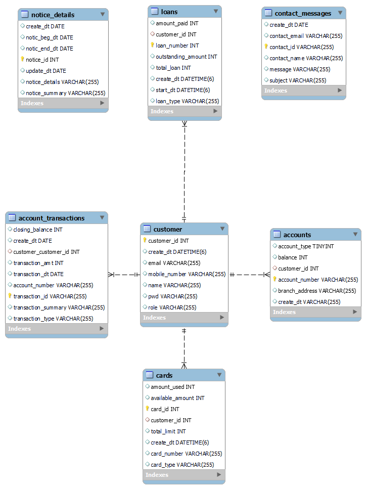

# Bank Duit - Online Banking Customer Portal

Bank Duit is an Online Banking Customer Portal aimed at providing users with convenient access to their accounts, transaction history, notices, and contact forms. This repository contains both the front-end and back-end components of the application.

## Requirements
# Software Requirements Document: Online Banking Customer Portal

## 1. Introduction

The goal of this project is to develop a comprehensive Online Banking Customer Portal that provides users with access to their accounts, enables transactions, and offers reporting functionalities. The application will consist of both front-end and back-end components, utilizing React.js for the front end and Spring Boot for the back end.

## 2. Functional Requirements

### 2.1 Core Banking Web Application

The core banking web application will have the following modules:

#### 2.1.1 Accounts Module
- Users should be able to view their account details.
- Users should be able to perform basic operations such as deposit, withdrawal, and transfer between accounts.

#### 2.1.2 Customer Module
- Users should be able to register as new customers.
- Users should be able to update their personal information such as address, contact details, etc.

#### 2.1.3 Transactions Module
- Users should be able to view their transaction history.
- Users should be able to filter transactions based on criteria such as date, type, etc.

#### 2.1.4 Reporting Module
- Users should be able to generate various reports such as account statements, transaction summaries, etc.

#### 2.1.5 Password Reset (Self-Help)
- Users should be able to reset their passwords through a self-help mechanism, such as security questions or email verification.

### 2.2 Design and Define Database Schema

- Design a relational database schema to store user information, account details, transaction records, etc.

### 2.3 Implement Customer Registration and Login/Logout Module

- Users should be able to register for an account with their personal details.
- Users should be able to log in and log out securely.

### 2.4 Implement MVC Application using Spring Boot

- Develop the back-end application using Spring Boot, following the Model-View-Controller (MVC) architecture.

### 2.5 Database Integration using JPA and Transaction Management using Spring

- Integrate the application with the database using Java Persistence API (JPA) for seamless data operations.
- Implement transaction management using Spring to ensure data consistency and integrity.

### 2.6 Logging Implementation

- Implement logging functionality to record important events and errors within the application for troubleshooting and auditing purposes.

## 3. Non-Functional Requirements

### 3.1 Security
- Implement robust authentication and authorization mechanisms to ensure user data security.
- Utilize HTTPS protocol for secure communication between the client and server.

### 3.2 Performance
- Optimize database queries and application code to ensure fast response times, even under heavy user load.
- Implement caching mechanisms where applicable to improve performance.

### 3.3 Scalability
- Design the application in a modular and scalable manner to accommodate future growth in user base and features.

### 3.4 Usability
- Ensure a user-friendly interface with intuitive navigation and clear instructions.
- Conduct usability testing to gather feedback and improve user experience.

### 3.5 Reliability
- Implement error handling and recovery mechanisms to handle unexpected failures gracefully.
- Conduct thorough testing to identify and resolve any potential issues before deployment.

## 4. Constraints

- The application must comply with relevant banking regulations and standards regarding data security and privacy.
- The development timeline should be adhered to, with regular progress updates and milestones.

## 5. Assumptions

- Users will have access to a modern web browser with support for JavaScript and HTML5 features.
- Sufficient hardware resources and infrastructure will be available for deployment and testing.

## 6. Glossary

- MVC: Model-View-Controller
- JPA: Java Persistence API
- HTTPS: Hypertext Transfer Protocol Secure

## 7. Revision History

- Version 1.0: Initial draft (Date: [Insert Date])
- Version 1.1: Updated requirements based on feedback (Date: [Insert Date])

## 8. References

https://docs.spring.io/spring-boot/docs/current/reference/htmlsingle/

https://react.dev/

This Software Requirements  outlines the key functionalities, design considerations, and constraints for developing the Online Banking Customer Portal. It serves as a reference for the development team to ensure alignment with project goals and stakeholder expectations.

## Architecture
## Architecture Overview of Bank Duit - Full Stack Application

Bank Duit is a comprehensive Online Banking Customer Portal that seamlessly integrates frontend and backend components to deliver a secure and user-friendly banking experience. The architecture of the full-stack application is designed to ensure scalability, reliability, and maintainability while adhering to modern software development principles.

### Frontend Architecture

The frontend of Bank Duit is built using React.js, a popular JavaScript library for building user interfaces. It follows a component-based architecture, where the application is divided into reusable and independent components. React Router is used for navigation, enabling seamless routing between different pages of the application without the need for page refreshes.

#### Component-Based Architecture

Bank Duit's frontend architecture is structured around reusable components, each responsible for rendering a specific part of the user interface. Components such as Navbar, Footer, Home, Login, and NoticesList encapsulate their respective functionalities and can be reused across different pages of the application. This approach promotes code reusability, modularity, and maintainability.

#### State Management

State management in Bank Duit is handled using React's built-in state and props mechanisms. Components manage their internal state to track user interactions and update the UI accordingly. Additionally, React Context is  integrated for more complex state management requirements, such as global state management across multiple components.

#### Styling and UI Framework

Bank Duit utilizes Bootstrap, a popular CSS framework, for responsive and visually appealing UI design. Bootstrap's grid system, components, and utilities are leveraged to ensure consistency and ease of styling across the application. Custom styling is applied as needed to meet specific design requirements and branding guidelines.

### Backend Architecture

The backend of Bank Duit is developed using Spring Boot, a powerful framework for building Java-based web applications. It follows a layered architecture, separating concerns into presentation, business logic, data access, and infrastructure layers.

#### Layered Architecture

Bank Duit's backend architecture is organized into the following layers:

1. **Presentation Layer**: This layer handles incoming HTTP requests and outgoing HTTP responses. Spring MVC controllers define RESTful endpoints for various functionalities, such as account management, authentication, transaction processing, and user management.

2. **Service Layer**: The service layer contains the business logic of the application. Service classes implement business rules and orchestrate interactions between different components. They are responsible for processing requests from the presentation layer, performing business operations, and interacting with the data access layer.

3. **Data Access Layer**: The data access layer interacts with the database to perform CRUD (Create, Read, Update, Delete) operations on persistent entities. Spring Data JPA repositories abstract away the complexity of data access and provide a high-level interface for interacting with the underlying database.

4. **Security Layer**: The security layer ensures the protection of sensitive information and enforces access control policies. Spring Security is used to implement authentication, authorization, and other security features. It provides mechanisms for user authentication, session management, CSRF protection, role-based access control, and encryption.

5. **Infrastructure Layer**: The infrastructure layer consists of configuration classes, utility classes, external dependencies, and other infrastructure-related components. It provides foundational services and resources required for the application to function correctly, such as database connections, logging configurations, exception handling, and dependency injection.

#### RESTful API Design

Bank Duit exposes a RESTful API that follows best practices for designing web APIs. Each endpoint is mapped to a specific HTTP method (GET, POST, PUT, DELETE) and represents a resource or action within the application. API endpoints are self-descriptive and adhere to RESTful principles such as resource naming, HTTP status codes, and statelessness.

### Integration and Communication

Communication between the frontend and backend of Bank Duit is facilitated through HTTP requests and responses. The frontend interacts with the backend by making asynchronous HTTP requests using libraries such as Axios or the built-in fetch API. Data is exchanged in JSON format, providing a lightweight and platform-independent means of communication.

### Deployment Architecture

Bank Duit can be deployed in various environments, including on-premises servers or cloud-based platforms such as AWS, Azure, or Google Cloud Platform. Docker containers can be used for containerization, providing a consistent and portable runtime environment. Kubernetes or Docker Swarm can be employed for container orchestration, enabling scalability, high availability, and automated deployment and scaling of application instances.

### Key Strenghts of Architecture

The architecture of Bank Duit's full-stack application is designed to deliver a robust, scalable, and secure online banking solution. By leveraging the strengths of React.js for the frontend and Spring Boot for the backend, Bank Duit provides users with a modern, intuitive, and feature-rich banking experience while ensuring the reliability and maintainability of the underlying software components.

## Frontend

The frontend of Bank Duit is built using React.js and offers the following functionalities:

### Components

1. **WithRouter.js**: A higher-order component (HOC) that provides router props to its wrapped component.
2. **AddNotice.js**: Component for adding notices. It includes a form for adding new notices and communicates with the NoticeDataService to perform CRUD operations.
3. **ContactForm.js**: Component for a contact form. It allows users to input their name, email, subject, and message, which is then sent using the ContactDataService.
4. **Footer.js**: Component for the footer section of the application. It displays contact information and social media links.
5. **Home.js**: Component for the home page. It contains links to the notices list and contact form.
6. **Login.js**: Component for the login page. It allows users to input their username and password and logs them in using AuthenticationService.
7. **LoginDashboard.js**: Component for the dashboard after logging in. It displays a welcome message and allows users to log out.
8. **Navbar.js**: Component for the navigation bar. It contains links to different sections of the application.
9. **Notice.js**: Component for displaying and editing individual notices. It communicates with the NoticeDataService to perform CRUD operations.
10. **NoticesList.js**: Component for displaying a list of notices. It includes a search feature and allows users to select and delete notices.
11. **AuthenticationService.js**: Service for handling authentication. It interacts with the server to authenticate users and manages user sessions.
12. **ContactDataService.js**: Service for handling contact form submissions. It communicates with the server to send contact form data.
13. **http-common.js**: Configuration for Axios HTTP client.
14. **notice-service.js**: Service for interacting with the server's notice-related endpoints.
15. **App.js**: Main component that sets up routing and renders other components.
16. **index.js**: Entry point of the React application.
17. **index.html**: HTML file that serves as the entry point for the React application.

### Technologies Used

- React.js
- React Router
- Axios
- Bootstrap

## Backend

The backend of Bank Duit is built using Spring Boot and provides REST API endpoints for various banking functionalities.

### Architecture Overview

The backend follows a multi-tier architecture, separating concerns into presentation, application logic, data, security, and infrastructure layers. It utilizes the Model-View-Controller (MVC) design pattern.

### Components

1. **Controllers**: Manage HTTP endpoints for different functionalities such as account management, authentication, balance inquiry, card management, loan management, contact inquiries, and notice retrieval.
2. **Repositories**: Interact with the database entities for CRUD operations.
3. **Entities**: Represent database tables.
4. **Security Configurations**: Handle authentication, authorization, CSRF protection, CORS configuration, and password encoding.
5. **Other Components**: Include filters, request DTOs, and utility classes.

### Technologies Used

- Spring Boot
- Spring MVC
- Spring Data JPA
- Hibernate ORM
- Spring Security

## Key Endpoints

For a detailed list of endpoints and their functionalities, please refer to the [API Documentation](http://localhost:8080/swagger-ui/index.html).

## Logging

Logging is implemented using Logback, with log files stored in the ./log directory.

## ERD

## Getting Started

To run the application locally, follow these steps:

1. Clone this repository.
2. Navigate to the frontend and backend directories and follow their respective setup instructions.
3. Start the backend server.
4. Start the frontend development server.
5. Access the application in your web browser.

---

