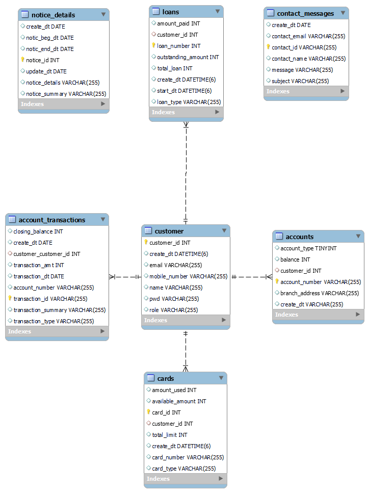

# Core Banking Web Application

## Overview
The Core Banking Application project is a Spring Boot backend REST API server designed to handle various modules such as Accounts, Customers, Transactions, and Reporting for a banking portal. This README provides an overview of the application architecture, components, and deployment considerations.

## Architecture Overview
The banking application follows a typical multi-tier architecture, separating concerns into presentation, application logic, data, security, and infrastructure layers. It employs the Model-View-Controller (MVC) design pattern for structuring the application components.

### 1. Presentation Layer
The presentation layer handles user interactions and displays information to users through RESTful API endpoints implemented using Spring MVC framework's `@RestController` annotations. Each controller class defines HTTP endpoints for specific functionalities such as account management, authentication, balance inquiry, card management, loan management, contact inquiries, and notice retrieval.

### 2. Application Layer
The application layer contains the business logic of the banking application. It processes requests from the presentation layer, interacts with the data layer to retrieve or update data, and performs necessary operations based on the business requirements. Service classes encapsulate the business logic for functionalities like account management, authentication, balance inquiry, card management, loan management, contact inquiries, and notice retrieval.

### 3. Data Layer
The data layer manages the persistence of application data by interacting with the database. It comprises entity classes representing database tables, Spring Data JPA repositories for CRUD operations on entities, and configurations for database connections. Hibernate ORM facilitates object-relational mapping between Java objects and database tables.

### 4. Security Layer
The security layer ensures authentication, authorization, and protection of sensitive information within the application. It includes authentication providers, security configurations, filters, and encryption mechanisms. Spring Security is used to implement security features such as user authentication based on username and password, authorization rules, CSRF protection, CORS configuration, and password encoding using BCrypt.

### 5. Infrastructure Layer
The infrastructure layer provides foundational services and resources required for the application to function correctly. It includes external libraries, frameworks, and infrastructure configurations. Components like utility classes, configuration classes, and external dependencies such as Spring Boot, Spring Security, Spring Data JPA, and Hibernate ORM are part of this layer.

## Key Technologies and Frameworks Used
- Spring Boot
- Spring MVC
- Spring Data JPA
- Hibernate ORM
- RESTful APIs
- API Documentation: springdoc-openapi-starter-webmvc-ui
- Spring Security

## Deployment Architecture
The application can be deployed on cloud-based platforms like AWS, Azure, or Google Cloud Platform using containerization technologies such as Docker and Kubernetes for scalability and ease of management. MySQL is used for storing application data securely. Continuous integration and continuous deployment (CI/CD) pipelines can be implemented for automated testing and deployment of new application versions.

## Architectural Highlights

The architecture is designed for scalability, maintainability, security, and performance. It leverages modern technologies and best practices to deliver a reliable and user-friendly banking experience. Components are organized into layers to separate concerns and facilitate ease of development, testing, and maintenance.

## ERD

## Application Components
The backend REST API server consists of various components:

1. **Controllers**: Manage HTTP endpoints for different functionalities such as account management, authentication, balance inquiry, card management, loan management, contact inquiries, and notice retrieval.
2. **Repositories**: Interact with the database entities for CRUD operations.
3. **Entities**: Represent database tables.
4. **Security Configurations**: Handle authentication, authorization, CSRF protection, CORS configuration, and password encoding.
5. **Other Components**: Include filters, request DTOs, and utility classes.

### Components Decsription
1. **Controllers**:
    - `AccountController`: Manages account-related HTTP endpoints such as getting account details, creating accounts, depositing, withdrawing, and transferring cash.
    - `AuthController`: Handles authentication-related HTTP endpoints like retrieving the current user's ID.
    - `BalanceController`: Manages balance-related HTTP endpoints such as getting balance details.
    - `CardsController`: Handles card-related HTTP endpoints like getting card details and issuing cards.
    - `ContactController`: Manages contact-related HTTP endpoints such as saving contact inquiries.
    - `NoticesController`: Manages notice-related HTTP endpoints like getting active notices.
2. **Repositories**:
    - Repositories for interacting with the database entities, such as `AccountsRepository`, `AccountTransactionsRepository`, `CardsRepository`, `ContactRepository`, `CustomerRepository`, `LoanRepository`, and `NoticeRepository`.
3. **Entities**:
    - Entity classes representing database tables, such as `Accounts`, `AccountTransactions`, `Cards`, `Contact`, `Customer`, `Loans`, and `Notice`.
4. **API Documentation**:
    - OpenAPI is used to automatically generate documentation for your REST APIs.
    - http://localhost:8080/swagger-ui/index.html
    
| Endpoint            | Method | Description                            | Parameters                                                          | Response                             |
|---------------------|--------|----------------------------------------|---------------------------------------------------------------------|--------------------------------------|
| /notices/{id}       | GET    | Get notice by ID                      | id (integer)                                                       | Notice                               |
|                     | PUT    | Update notice                         | id (integer), request body (Notice)                                | Notice                               |
|                     | DELETE | Delete notice                         | id (integer)                                                       | Object                               |
| /withdraw           | POST   | Withdraw cash                         | accountNumber (string), amount (integer)                           | Accounts                             |
| /transfer           | POST   | Transfer cash                         | fromAccountNumber (string), toAccountNumber (string), amount (integer) | OK                                   |
| /notices            | GET    | Get notices                           | noticeSummary (string)                                             | Array of Notice                      |
|                     | POST   | Create notice                         | request body (Notice)                                              | Notice                               |
|                     | DELETE | Delete all notices                    |                                                                     | Object                               |
| /issueLoan          | POST   | Issue loan                            | customerId (integer)                                               | Object                               |
| /issueCard          | POST   | Issue card                            | customerId (integer)                                               | String                               |
| /deposit            | POST   | Deposit cash                          | accountNumber (string), amount (integer)                           | Accounts                             |
| /createAccount      | POST   | Create account                        | customerId (integer), request body (Accounts)                      | Accounts                             |
| /contact            | POST   | Save contact inquiry details          | request body (Contact)                                             | Contact                              |
| /myLoans            | GET    | Get loan details                      | id (integer)                                                       | Object                               |
| /myCards            | GET    | Get card details                      | customerId (integer)                                               | Array of Cards                       |
| /myBalance          | GET    | Get balance details                   | id (integer)                                                       | integer                              |
| /myAccount          | GET    | Get account details                   | id (integer)                                                       | Accounts                             |

5. **httpexcahnges**:
    - `The httpexchanges endpoint provides information about HTTP request-response exchanges. 
    - http://localhost:8080/actuator/httpexchanges

6. **Logging**:
    - `logback-spring.xml: Defines loggers and appenders for system logs and AOP logs.
    - application.properties: Configures the file path for log files.
    - system and app logs are stored in ./log directory
